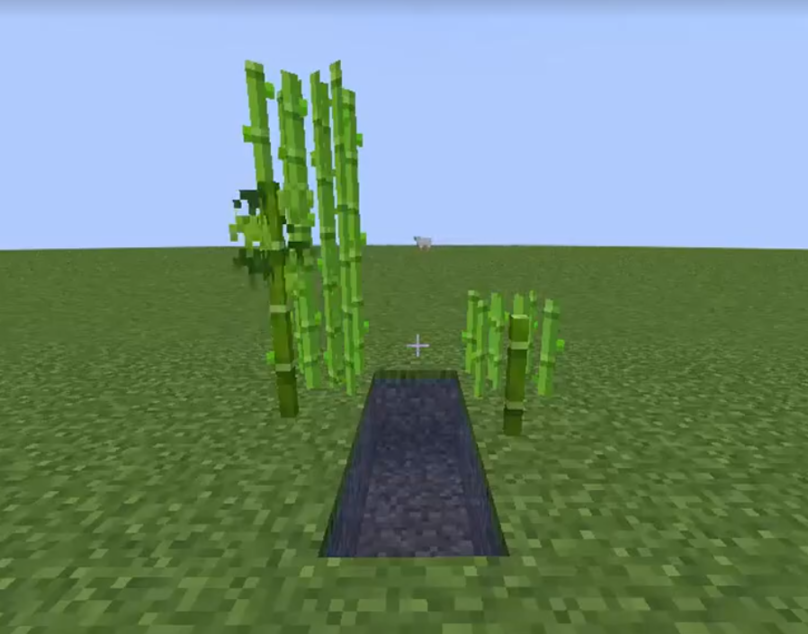

# GrowStop



GrowStop is a minecraft plugin that allows you to prevent
certain blocks from growing using shears by right clicking them.

## Commands:

- /growstop add <block-type\> - Adds block to supported block list
- /growstop remove <block-type\> - Remove block from supported block list
- /growstop reload - Reloads the config file
- /growstop list - Lists all supported blocks

## Permissions:

- growstop.use.*
- growstop.use.<block-type>
- growstop.command.reload
- growstop.command.add
- growstop.command.remove
- growstop.command.list

## Using GrowStop as dependency

Add jitpack repository to your project.

Gradle:

```groovy
maven { url = "https://jitpack.io" }
```

Maven:

```xml

<repository>
    <id>jitpack.io</id>
    <url>https://jitpack.io</url>
</repository>
```

Add the plugin as dependency.

Gradle:

```groovy
compileOnly "com.github.KaspianDev:GrowStop:master-SNAPSHOT"
```

Maven:

```xml

<dependency>
    <groupId>com.github.KaspianDev</groupId>
    <artifactId>GrowStop</artifactId>
    <version>master-SNAPSHOT</version>
</dependency>
```

Add the plugin to `depend` or `softdepend` in `plugin.yml`.

```yml
depend: [ GrowStop ]
```

The API currently only contains 1 event:

- `GrowStopTagEvent` - Triggers when a block is about to be tagged using shears.
  Can be cancelled.

## Building:

```sh
git clone https://github.com/KaspianDev/GrowStop.git
```

```sh
./gradlew build
```

Artifact will be located in build/libs.
